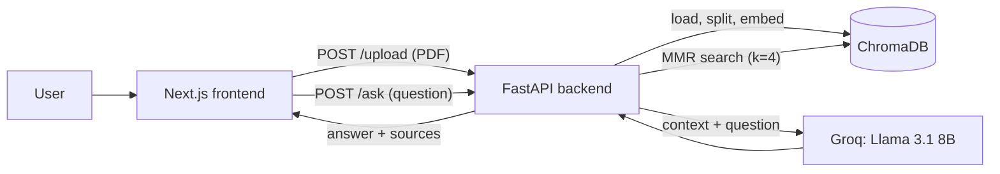

# 📚 RAG Book Assistant

Chat with any PDF book. Upload a document, ask questions in plain English, and get answers **grounded in the text**, with the exact source pages shown for every reply.

Built as a full-stack Retrieval-Augmented Generation (RAG) app: a **FastAPI** backend (LangChain + ChromaDB + Groq) and a responsive **Next.js** chat interface.


## Features

- **PDF ingestion**: upload a PDF, which is split into overlapping chunks, embedded, and stored in a persistent vector database
- **Grounded answers**: the LLM is instructed to answer only from retrieved context, and says so when the answer isn't in the document
- **Source citations**: every answer comes with the retrieved passages and their page numbers
- **MMR retrieval**: Maximal Marginal Relevance picks relevant *and* diverse chunks, reducing repetitive context
- **Polished chat UI**: markdown-rendered answers, copy button, response time, suggested prompts, typing indicator, persistent chat history, drag-and-drop upload, mobile-friendly layout

## Architecture



**Indexing:** PDF → `PyPDFLoader` → `RecursiveCharacterTextSplitter` (1000 chars, 200 overlap) → `all-MiniLM-L6-v2` embeddings → ChromaDB

**Querying:** question → MMR retriever (`k=4`, `fetch_k=10`, `lambda_mult=0.5`) → prompt with retrieved context → `llama-3.1-8b-instant` (temperature 0) → answer + source chunks

## Tech Stack

| Layer | Tools |
|---|---|
| Frontend | Next.js (App Router), React, TypeScript, Tailwind CSS, react-markdown, lucide-react |
| Backend | FastAPI, Uvicorn |
| RAG | LangChain, ChromaDB, HuggingFace `sentence-transformers/all-MiniLM-L6-v2` |
| LLM | Llama 3.1 8B Instant via Groq API |

## Project Structure

```
RAG/
├── api.py               # FastAPI backend (RAG logic)
├── .env                 # GROQ_API_KEY (not committed)
├── chroma_db/           # vector store (created on first upload, not committed)
└── frontend/            # Next.js app
    ├── app/             # page + layout
    ├── components/      # Sidebar, Chat, MessageBubble
    └── lib/api.ts       # typed API client
```

## Getting Started

### Prerequisites

- Python 3.12+ and [uv](https://github.com/astral-sh/uv) (or pip)
- Node.js 18+
- A free [Groq API key](https://console.groq.com)

### 1. Backend

```bash
# from the project root
uv venv --python 3.12
# Windows: .venv\Scripts\activate    |  macOS/Linux: source .venv/bin/activate

uv pip install fastapi uvicorn python-multipart python-dotenv \
  langchain-core langchain-community langchain-text-splitters \
  langchain-chroma chromadb langchain-huggingface sentence-transformers \
  langchain-groq pypdf
```

Create a `.env` file in the project root:

```
GROQ_API_KEY=your_key_here
```

Run the API:

```bash
uvicorn api:app --reload --port 8000
```

> The first start downloads the embedding model (~90 MB), and `sentence-transformers` pulls in PyTorch, so the initial install is large.

### 2. Frontend

```bash
cd frontend
npm install
npm run dev
```

Open [http://localhost:3000](http://localhost:3000). To point at a different backend, set `NEXT_PUBLIC_API_URL` in `frontend/.env.local`.

## API Reference

| Method | Endpoint | Description |
|---|---|---|
| `GET` | `/status` | `{ "ready": bool }`: whether a vector DB exists |
| `POST` | `/upload` | Multipart PDF upload. Replaces the current book. Returns `{ filename, pages, chunks }` |
| `POST` | `/ask` | Body: `{ "question": "..." }`. Returns `{ answer, sources: [{ content, page, source }] }` |

## Limitations

Being upfront about the current scope:

- **Single shared knowledge base**: one book at a time; uploading a new PDF replaces the previous one (no per-user isolation)
- **No conversation memory**: each question is answered independently, so follow-ups like "explain that simpler" won't work
- **No streaming**: the full answer appears at once
- **Text PDFs only**: scanned/image-based PDFs need OCR, which isn't included
- **Small LLM**: Llama 3.1 8B is fast and free-tier friendly, but can miss nuance on complex questions

## Roadmap

- [ ] Streaming responses (Server-Sent Events)
- [ ] Conversation memory / follow-up questions via query rewriting
- [ ] Multiple books with per-collection selection
- [ ] OCR support for scanned PDFs
- [ ] Retrieval evaluation (hit rate on a small question set)
- [ ] Docker Compose for one-command setup

## Author

**Yaniya**: [GitHub](https://github.com/Yaniyamalik)